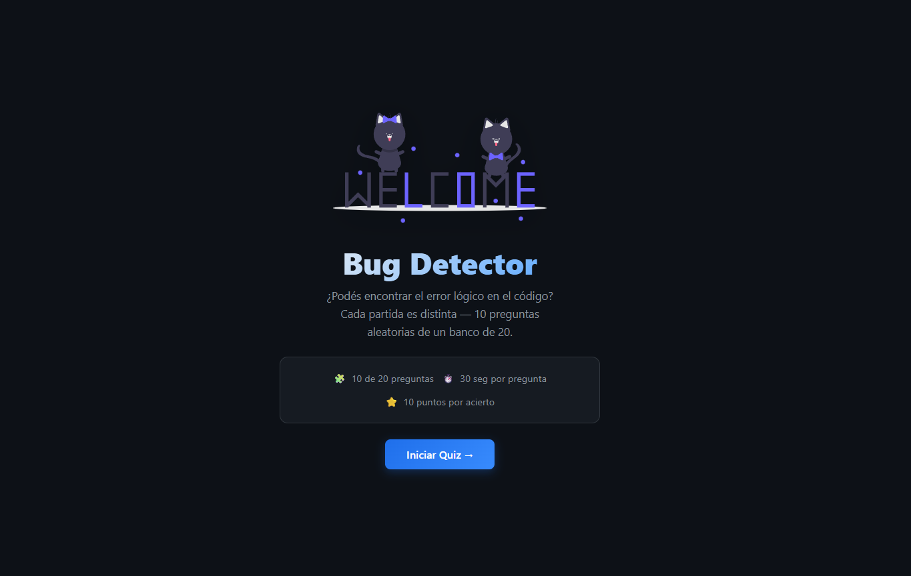
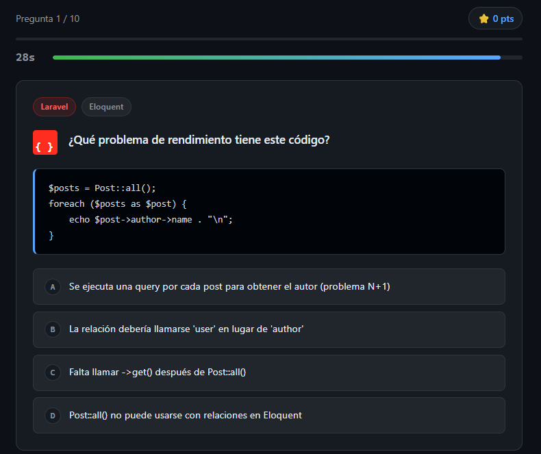
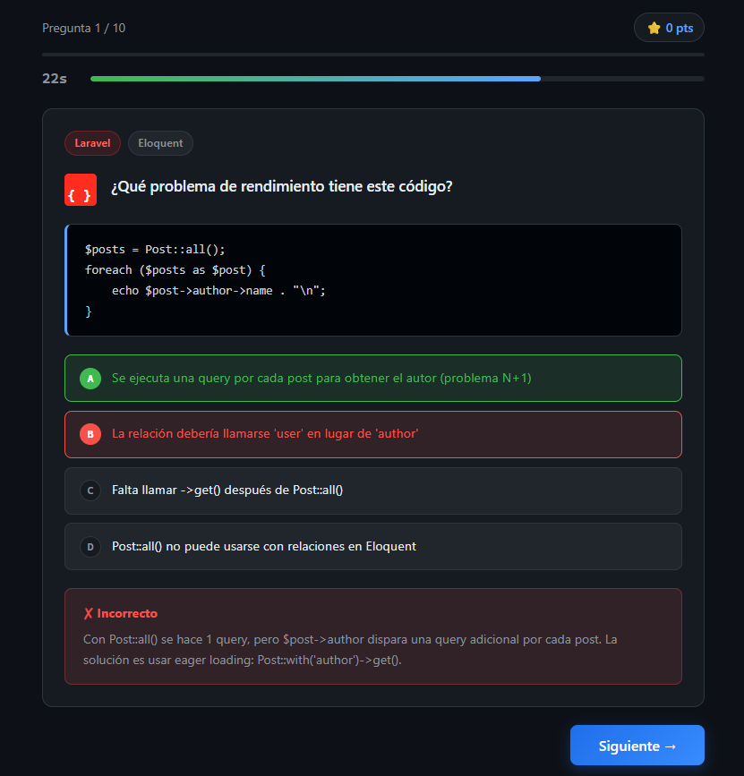
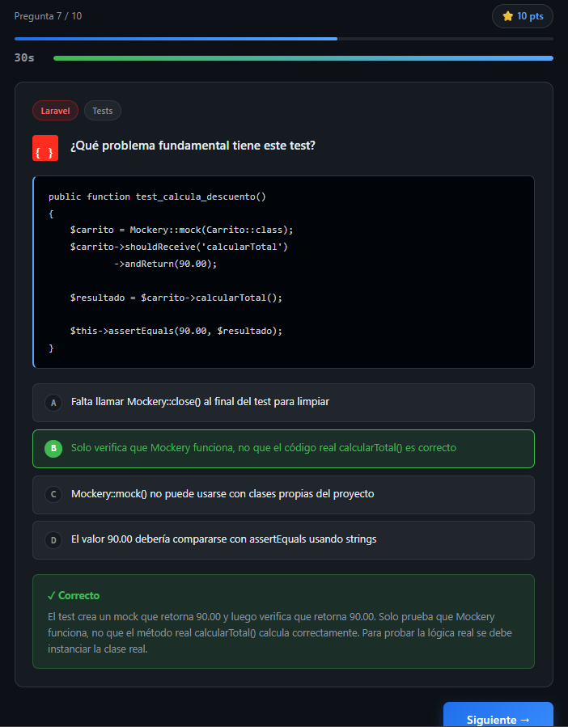
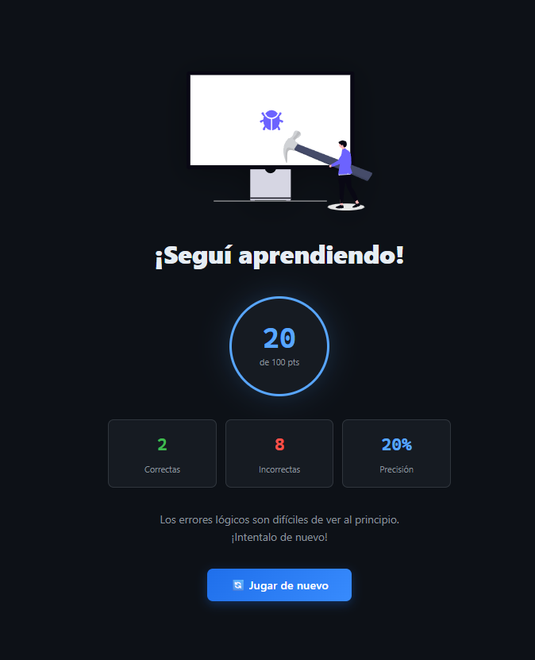

# Bug Detector — Quiz de Lógica en Código

Proyecto Personal | IF7102 Multimedios | I Ciclo 2026 | UCR

## Descripción

**Bug Detector** es un quiz interactivo donde el usuario debe identificar errores lógicos en fragmentos de código JavaScript y Laravel. El juego incluye temporizador por pregunta, retroalimentación inmediata con explicación del error, y pantalla de resultados con estadísticas.

**Opción elegida:** Opción 5 — Juego Educativo de Un Nivel  
**Framework:** React 19 + Vite  
**Modalidad:** Quiz con temporizador (30 segundos por pregunta)

## Estructura de componentes

```
src/
├── App.jsx                  # Componente raíz — maneja estado global del juego
├── App.css                  # Estilos globales de la aplicación
├── index.css                # Variables CSS y reset base
├── main.jsx                 # Punto de entrada de React
└── components/
    ├── StartScreen.jsx      # Pantalla de inicio
    ├── GameScreen.jsx       # Pantalla del juego (timer + pregunta)
    ├── ResultScreen.jsx     # Pantalla de resultados
    ├── QuestionCard.jsx     # Tarjeta reutilizable de pregunta + opciones
    └── Timer.jsx            # Componente de temporizador visual
```

## Cómo ejecutar

```bash
npm install
npm run dev
```

Luego abrir `http://localhost:5173` en el navegador.

## Recursos multimedia

Efectos de sonido incluidos en `public/sounds/`:

| Archivo         | Descripción                    | Fuente               |
|-----------------|--------------------------------|----------------------|
| `correct.wav`   | Sonido de respuesta correcta   | Freesound.org (CC0)  |
| `wrong.mp3`     | Sonido de respuesta incorrecta | Freesound.org (CC0)  |
| `finish.mp3`    | Fanfarria al terminar el quiz  | Freesound.org (CC0)  |

Ilustraciones SVG incluidas en `public/images/` (Undraw.co, licencia abierta):

| Archivo             | Uso                                  |
|---------------------|--------------------------------------|
| `welcome.svg`       | Pantalla de inicio                   |
| `proud-coder.svg`   | Resultado — puntaje alto (≥80%)      |
| `programming.svg`   | Resultado — puntaje medio (50–79%)   |
| `fixing-bugs.svg`   | Resultado — puntaje bajo (<50%)      |

## Datos del juego

Las preguntas se cargan dinámicamente desde `public/data/questions.json` usando `fetch()`. El archivo contiene un banco de 20 preguntas sobre errores lógicos en JavaScript, Laravel/Eloquent y Tests de Laravel. Cada partida selecciona 10 preguntas al azar y baraja las opciones de respuesta.

## Framework

**React 19** con hooks. Conceptos aplicados:
- `useState` — estado del juego (pantalla activa, puntuación, índice)
- `useEffect` — carga del JSON, lógica del temporizador y eventos de teclado
- `useCallback` — handler del timeout del timer
- Props para comunicación entre componentes padre e hijo
- Renderizado condicional (`{screen === 'game' && <GameScreen />}`)
- `addEventListener('keydown')` — teclas 1–4 para seleccionar opción y Enter para continuar

## Capturas de pantalla

### Pantalla de inicio


Pantalla de bienvenida con la ilustración animada, el título del juego y un resumen de las reglas: 10 preguntas de un banco de 20, 30 segundos por pregunta y 10 puntos por acierto. El botón **Iniciar Quiz** comienza una partida con preguntas aleatorias.

---

### Pregunta activa (sin responder)


Vista del juego con una pregunta en curso. Se muestra el progreso (Pregunta 1/10), el puntaje actual, la barra de tiempo y el fragmento de código a analizar. Las cuatro opciones están disponibles para seleccionar.

---

### Respuesta incorrecta


Retroalimentación tras elegir una respuesta incorrecta: la opción seleccionada se marca en rojo, la opción correcta se resalta en verde y aparece una explicación detallada del error. El botón **Siguiente →** avanza a la siguiente pregunta.

---

### Respuesta correcta (pregunta de Laravel Tests)


Ejemplo de una pregunta sobre Tests en Laravel con respuesta correcta. La opción acertada se marca en verde y la explicación confirma por qué el test analizado genera un falso positivo. El marcador muestra los puntos acumulados.

---

### Pantalla de resultados


Pantalla final con el puntaje total, número de respuestas correctas e incorrectas, y el porcentaje de precisión. La ilustración y el mensaje motivacional cambian según el rendimiento obtenido (alto, medio o bajo).
